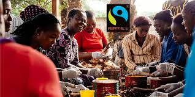

# Aufgabe "Fairtrade"

Zum Ergebnis [hier klicken](https://fairtrade.fls.oppermann.fun/)!

## [Aufabenstellung](https://moodle.nibis.de/flshi/mod/assign/view.php?id=4714)

### Gestalten Sie eine HTML-Seite mit CSS und beachten Sie die angegebene Vorgehensweise

1. Erstellen Sie einen Ordner „fairtrade“.
2. Speichern Sie die Datei „fairtrade.html“ in den Ordner.
3. Erstellen Sie einen Unterordner Bilder und speichern Sie die Bilder dort ab.
4. Erstellen Sie einen Unterordner „css“ und erstellen Sie darin eine (zunächst noch leere) CSS-Datei mit dem Namen „format.css“.
5. Verbinden Sie die Webseite im Quelltext mit der CSS-Datei!
6. Erstellen Sie in der CSS-Datei die Formate:

**Die Farben und die Ausrichtungen der Überschriften, Absätze und Linien sowie der Bilder sollen der Vorlage entsprechen.**

Beachten Sie die Hinweise im Quelltext und die Anmerkungen in der Vorlage.


> ***Es handelt sich hierbei um eine [Aufgabenstellung aus dem Moodle der Friedrich-List-Schule](https://moodle.nibis.de/flshi/mod/assign/view.php?id=4714)***

## Ergebnis

### Dateistrucktur

```sh
fairtrade
   ├── bilder
   │   ├── fairtrade logo.jpg
   │   ├── fairtrade logo transparent.png
   │   ├── natur.jpg
   │   ├── natur transparent.png
   │   ├── partner.jpg
   │   └── partner transparent.png
   ├── css
   │   └── format.css
   └── fairtrade.html
```

### HTML

```html
<!DOCTYPE html>

<html>

<head>
	<title>Fairtrade</title>
	<meta content="text/html; charset=utf-8" http-equiv="Content-Type">
	<link rel="stylesheet" href="./css/format.css">

</head>

<body>
	
	
	<h1>Hildesheim ist „Fairtrade-Town“!</h1>
	<!--Einleitung-->
	<p>
		Die Stadt Hildesheim engagiert sich für fairen und regionalen Handel und hat dafür
		<!--Hervorhebung--> <strong> vom Verein Transfair im September 2017 das
			Siegel „Fairtrade-Town“
		</strong>
		<!--Hervorhebung Ende--> erhalten! Das Siegel wird von dem Verein "TransFair" vergeben, welcher eine unabhängige
		Initiative zur Förderung
		des Fairen Handels ist.
	</p>

	<hr class="orange">

	<h2>Was ist Fairtrade?</h2>

	<p>
		<strong>
			Bäuerinnen und Bauern, Arbeiterinnen und Arbeiter auf der ganzen Welt sorgen dafür, dass wir in Supermärkten
			täglich ein umfangreiches Lebensmittelangebot
			vorfinden. Sie tragen nach wie vor zu 70 Prozent der Nahrungsmittelversorgung weltweit bei. Landwirtschaft
			ist
			die bedeutendste Einkommens- und
			Beschäftigungsquelle für arme Haushalte in ländlichen Gebieten, 40 Prozent der gegenwärtigen Weltbevölkerung
			bestreitet aus ihr ihren Lebensunterhalt.
		</strong>
	</p>

	<hr class="grau">

	<h3>Faire Partnerschaft</h3>

	<p>
		<!--Hervorhebung2-->
		<em> Fairtrade </em>
		<!--Hervorhebung2 Ende-->
		<strong>
			verbindet Konsumentinnen und Konsumenten, Unternehmen und Produzentenorganisationen und
			verändert Handel(n) durch bessere Preise für
			Kleinbauernfamilien, sowie menschenwürdige Arbeitsbedingungen für Beschäftigte auf Plantagen in
			Entwicklungs-
			und Schwellenländern.
		</strong>
	</p>

	

	<hr class="grau">

	<h3>Bessere Arbeitsbedingungen und selbstbestimmte Zukunft </h3>

	<p>
		<!--Hervorhebung2-->
		<em> Fairtrade </em>
		<!--Hervorhebung2 Ende-->
		<strong>
			ermöglicht es Produzentinnen und Produzenten aus Afrika, Asien und Lateinamerika, zu
			einer einflussreichen Kraft für Veränderungen
			in ihrem Umfeld zu werden und selbstbestimmt ihre Zukunft zu gestalten.
			So ermöglicht die Zahlung der Fairtrade-Prämie für Soziales, Infrastruktur und Bildung beispielsweise den
			Bau
			von
			Schulen und Gesundheitszentren.
		</strong>
	</p>

	<hr class="grau">

	<h3>Fair zur Natur</h3>

	<p>
		Umweltschonende Anbaumethoden werden besonders gefördert und Bioaufschläge bezahlt.
	</p>

	
	<hr class="grau">

</body>

</html>
```


### CSS

```css
body{
    background-color: #90EE90;
    font-family: Arial, Helvetica, sans-serif;
    overflow-x: hidden; /* Verstecke Horizontalen Scroller (Unsicher wie dieses Ding heißt)*/
}
h1{
    text-align: center;
}

em{
    color: orange;
    font-weight: bold;
}

h1,h2,h3{
    color: green;
}
h3{
    font-style: italic;
}
img{
    border-radius: 2.5px;
}
#logo{
    background-color: #fff;
}
#wasserzeichen{
    background-color: #fff;
    float: right;
    margin-right: -10px;
}

hr{
    height: 10px;
    /*
    Die Höhe wird in der Vorlage
    nur mit Höhe: angegeben,
    aber ohne Wert
    */
}

.orange{
    background-color: orange;
    width: 600px;
    border: none;
}

.grau{
    background-color: gray;
    width: 400px;
    border: none;
}
```
