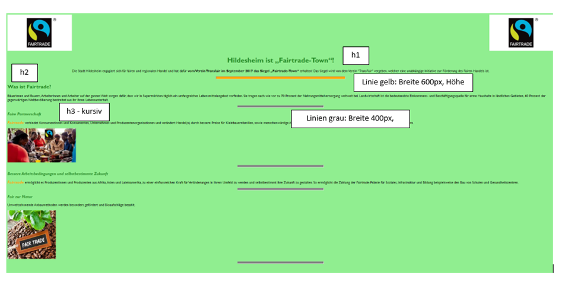

# [Aufabenstellung](https://moodle.nibis.de/flshi/mod/assign/view.php?id=4714)

## Gestalten Sie eine HTML-Seite mit CSS und beachten Sie die angegebene Vorgehensweise

1. Erstellen Sie einen Ordner „fairtrade“.
2. Speichern Sie die Datei „fairtrade.html“ in den Ordner.
3. Erstellen Sie einen Unterordner Bilder und speichern Sie die Bilder dort ab.
4. Erstellen Sie einen Unterordner „css“ und erstellen Sie darin eine (zunächst noch leere) CSS-Datei mit dem Namen „format.css“.
5. Verbinden Sie die Webseite im Quelltext mit der CSS-Datei!
6. Erstellen Sie in der CSS-Datei die Formate:

**Die Farben und die Ausrichtungen der Überschriften, Absätze und Linien sowie der Bilder sollen der Vorlage entsprechen.**

Beachten Sie die Hinweise im Quelltext und die Anmerkungen in der Vorlage.

> ***Es handelt sich hierbei um eine [Aufgabenstellung aus dem Moodle der Friedrich-List-Schule](https://moodle.nibis.de/flshi/mod/assign/view.php?id=4714)***
